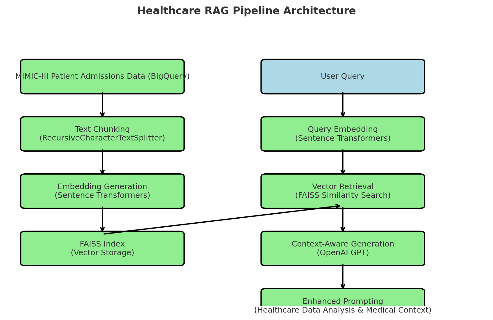

# Healthcare RAG with MIMIC-III


This repository demonstrates Retrieval-Augmented Generation (RAG) techniques applied to healthcare data using the MIMIC-III database. RAG systems are particularly valuable in healthcare for answering questions about patient records, providing evidence-based clinical information, and supporting decision-making.

## Project Overview

This project implements a RAG system that can answer questions about hospital admission data by:
- Querying MIMIC-III admission records
- Converting text to embeddings using sentence transformers
- Building a FAISS vector index for efficient retrieval
- Using prompt engineering to improve answer generation with OpenAI models

**Please note:**
* This pipeline is not comprehensive or production-ready. It intentionally omits advanced error handling, extensive logging, modularization, and configurable parameters.
* Potential future work (e.g., an upcoming RAG pipeline with clinical notes) will incorporate these enhancements along with more robust preprocessing, healthcare-specific embedding models, and improved evaluation metrics.

## Key Features

- Simple but functional RAG pipeline for healthcare data
- Demonstrates how improved prompting can enhance the accuracy and relevance of generated answers.
- Demonstration of date/time reasoning in medical context
- Provides a foundation for extending the pipeline to handle more complex clinical notes.

# Getting Started

## Prerequisites
1. **MIMIC-III Access**: Obtain access to the MIMIC-III database through [PhysioNet](https://physionet.org/).
2. **Google Cloud Account**: Set up a Google Cloud account with access to BigQuery.
3. **OpenAI API Key**: Obtain an API key from [OpenAI](https://platform.openai.com/).

## Installation
1. **Clone this repository**:
   ```bash
    git clone https://github.com/kulsoom-abdullah/mimic-simple-rag.git
    cd mimic-simple-rag
    ```

2. **Install dependencies:**
   ```bash
   pip install -r requirements.txt
    ```
3. **Setup the `.env` file with your OpenAI API key:**
   
    ```bash
    echo OPENAI_API_KEY="your-api-key-here" > .env
    ```

### Important Setup Instructions

Before running the notebook, please ensure the following:

1. **Google Cloud Authentication:**  
Authenticate your Google Cloud account for BigQuery access by running:
   ```bash
   gcloud auth application-default login
    ```
Alternatively, set up a service account with the required permissions and define the environment variable `GOOGLE_APPLICATION_CREDENTIALS` to point to your JSON key file. For more details, refer to the Google Cloud Authentication Guide.

2. **Notebook Execution:**  
   Open the Jupyter Notebook (`mimic_simple_rag.ipynb`) and run the cells step by step to verify that everything executes without errors.

3. **Dependencies and First-Run Experience:**  
   Run the following command to install all required dependencies:
   ```bash
   pip install -r requirements.txt
   
Note that some large models (e.g., the sentence-transformers model) will be downloaded on first use. This may take a few minutes during the initial run.

## Usage

The main notebook demonstrates the complete pipeline:

```python
# Set your Google Cloud project
os.environ["GOOGLE_CLOUD_PROJECT"] = "your-project-name"
```

## RAG Pipeline Architecture



The diagram (`rag_pipeline.png`) illustrates the architecture of the Healthcare RAG Pipeline. Here's a breakdown of the steps:

1. **MIMIC-III Patient Admissions Data (BigQuery):**

The pipeline starts by querying patient admission records from the MIMIC-III database stored in BigQuery.

2. **Text Chunking:**

The admission records are preprocessed and split into smaller chunks using RecursiveCharacterTextSplitter to maintain clinical context.

3. **Embedding Generation:**

Each text chunk is converted into a vector embedding using Sentence Transformers.

4. **FAISS Index:**

The embeddings are stored in a FAISS index for efficient similarity search.

5. **User Query:**

When a user submits a query, it is also converted into an embedding using Sentence Transformers.

6. **Vector Retrieval:**

The FAISS index performs a similarity search to retrieve the most relevant text chunks based on the query embedding.

7. **Context-Aware Generation:**

The retrieved chunks are combined with the user query and sent to OpenAI's GPT model for context-aware answer generation.

8. **Enhanced Prompting:**

The system uses enhanced prompting techniques tailored for healthcare data to improve the relevance and accuracy of the generated answers.

## Limitations

- This is a minimal example using only admission data
- Limited to a small number of records for demonstration
- Does not include more complex healthcare-specific preprocessing
- Uses general-purpose embeddings rather than clinical embeddings


## Potential Future Work

The next phase will extend this approach to clinical notes in MIMIC-III, implementing:
- Advanced chunking strategies for longer medical texts
- Healthcare-specific embedding models
- Multi-chunk retrieval and context management
- Named entity recognition for medical terms

## License

This project is licensed under the MIT License - see the LICENSE file for details.

## Acknowledgments

- [MIMIC-III Clinical Database](https://physionet.org/content/mimiciii/1.4/)
- [PhysioNet](https://physionet.org/) for hosting the data
- [LangChain](https://github.com/langchain-ai/langchain) for RAG components
- [Sentence-Transformers](https://github.com/UKPLab/sentence-transformers) for embeddings
- [FAISS](https://github.com/facebookresearch/faiss) for vector indexing
- [OpenAI](https://openai.com/) for providing the GPT model used in this project.
